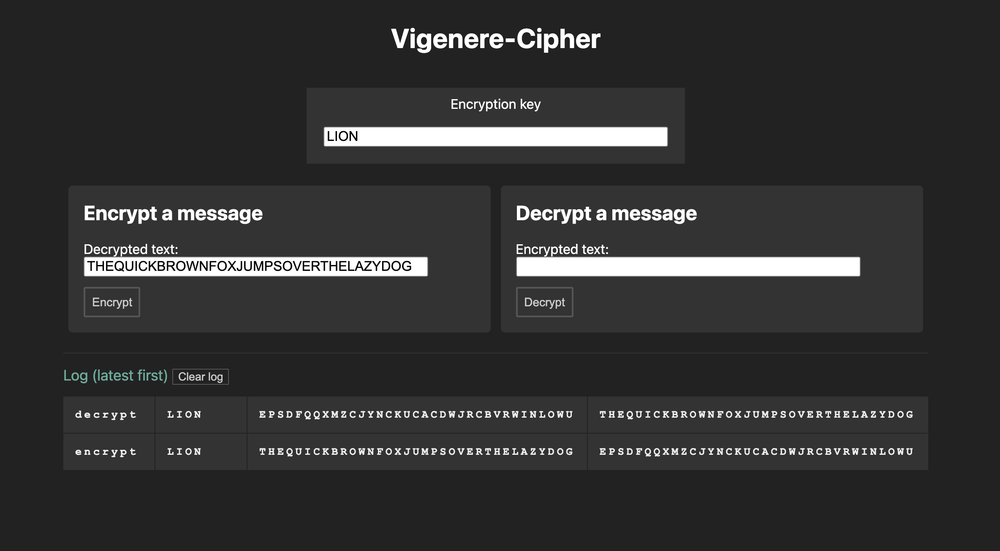

# Welcome to my Vigenere Cipher project

This project is my interpretation of the [Vigenère cipher](https://en.wikipedia.org/wiki/Vigen%C3%A8re_cipher).

By: @jimthedev / jimthedev#0751 for [Dev Jam](https://discord.gg/7wdzgNGV)

**I used native ES modules and several other modern browser APIs so please use a modern browser to view this code.**

## Quickstart

View the [live project](https://vigenere-cipher-ten.vercel.app/).

Or, to run locally you can download the code [on github](https://github.com/jimthedev/vignere-cipher) and then run `npx http-server` (you will need node/npm installed for this) and then open [http://127.0.0.1:8080/](http://127.0.0.1:8080/]).

## Running tests

You can run the tests in the browser console by typing `executeTests()`;

## Technical notes and limitations

I ended up using inline styles due to time constraints but these would all be moved to a stylesheet in a final version.

I used ES modules and several other modern browser APIs so a user should use a modern browser to view this code.

## Considerations

I decided to do a few things differently from the project spec. Here I will present my rationale.

I do not disable encrypt or decrypt buttons but rather allow a user to attempt an encrypt or decrypt but simply do nothing when the field is empty. Some future implementation should show an error message but this seemed outside the scope of the tool I wanted to build.

I added a log so that a user can see the results of their various encrypt / decrypt attempts. This would not be something we might want in an actual project due to the sensitive nature of the content but for someone hoping to see the various outputs of the cipher it is quite helpful.

In addition to these features I decided that the encryption and decryption should simply move the encrypted value back and forth, giving a user the ability to see that their result has processed and now they can reverse that operation.